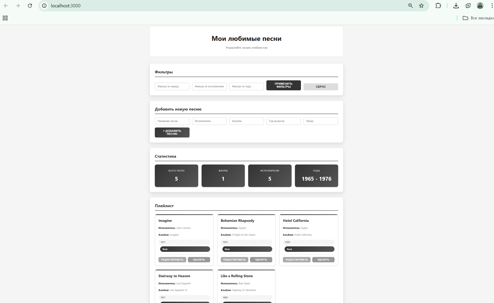

# Favorite Songs API

Простое Express.js-приложение для управления списком любимых песен с веб-интерфейсом и RESTful API.



## Структура проекта
```
favorite-songs-api/
├── controllers/ # Логика обработки запросов
├── data/ # Хранилище данных
│ └── songs.json # Начальные данные (массив песен)
├── image/ # Изображения (если есть)
├── middleware/ # Пользовательские middleware
│ └── logger.js # Middleware для логирования запросов
├── public/ # Статические файлы (HTML, CSS, JS)
│ ├── index.html # Главная страница
│ ├── script.js # Клиентский JavaScript
│ └── styles.css # Стили
├── routes/ # Маршруты API
│ └── songs.js # Роуты для работы с песнями
├── server/ # Основной серверный код
│ └── index.js # Запуск сервера и настройка приложения
├── package.json # Зависимости и скрипты
└── package-lock.json # Блокировка версий зависимостей
```

## Функциональность

### API (все эндпоинты начинаются с `/api/songs`)
- **GET /** — получить все песни (поддерживает фильтрацию через query-параметры: `genre`, `artist`, `year`)
- **GET /:id** — получить песню по ID
- **GET /stats** — получить статистику (общее количество, уникальные жанры, исполнители, диапазон лет)
- **POST /** — добавить новую песню
- **PUT /:id** — обновить песню
- **DELETE /:id** — удалить песню

### Веб-интерфейс
- Просмотр списка песен
- Фильтрация по жанру, исполнителю и году
- Добавление, редактирование и удаление песен
- Отображение статистики

### Middleware
- `requestLogger` — логирует все входящие запросы с временной меткой в формате `ru-RU`

## Технологии

- **Backend**: Node.js, Express.js
- **Frontend**: HTML5, CSS3, Vanilla JavaScript (Fetch API)
- **Архитектура**: MVC-подобная (разделение routes и controllers)

## Запуск проекта

1. Клонируйте репозиторий:
   ```bash
   git clone https://github.com/drpepperus666/favorite-songs-api.git
   cd favorite-songs-api
   npm install
   npm start
